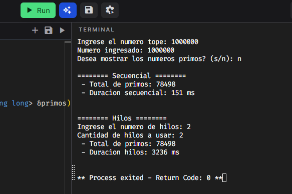

# Números primos con programación paralela

## Ejecución online
Se esta empleando un playground para C++

1. Acceder a [https://www.onlineide.pro/playground/share/ff8894fa-eb6a-4f67-a597-ec7872f33654](https://www.onlineide.pro/playground/share/ff8894fa-eb6a-4f67-a597-ec7872f33654)
2. Click en el botón **run**


3. Brindar los inputs requeridos en la terminal.
4. Listo.



> Es usual que en el entorno online la ejecución sea mas tardada, debido a la poca capacidad de las maquinas.


## Ejecución local
*Compilación:*
Para compilar el ejecutable se emplea el siguiente codigo en terminal (Teniendo instalado MINGW)
```powershell
g++ main.cpp -o main -std=c++11
```

*Uso:*
```powershell
./main.exe 
```

*Ejemplo:*
Número primos hasta 10000000

1. Ejecutar:
```powershell
./main.exe
```
2. Resultado:

