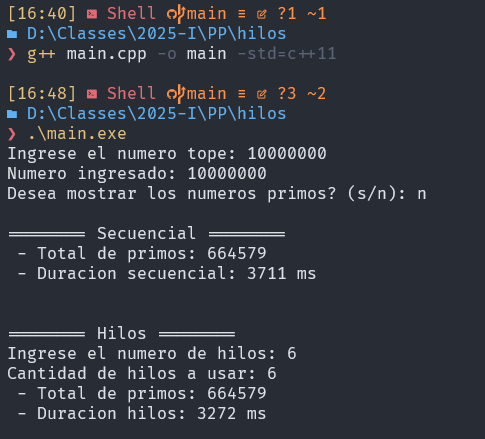

# Números primos con programación paralela

*Compilación:*
Para compilar el ejecutable se emplea el siguiente codigo en terminal (Teniendo instalado MINGW)
```powershell
g++ main.cpp -o main -std=c++11
```

*Uso:*
```powershell
./main.exe <número tope>
```

Donde: **<número tope>** es el número hasta el que se desplegaran los números primos

*Ejemplo:*
Número primos hasta 10000

1. Ejecutar:
```powershell
./main.exe 10000
```
2. Resultado:
